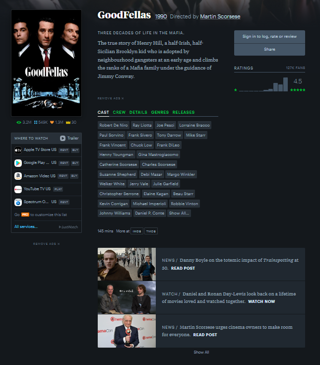
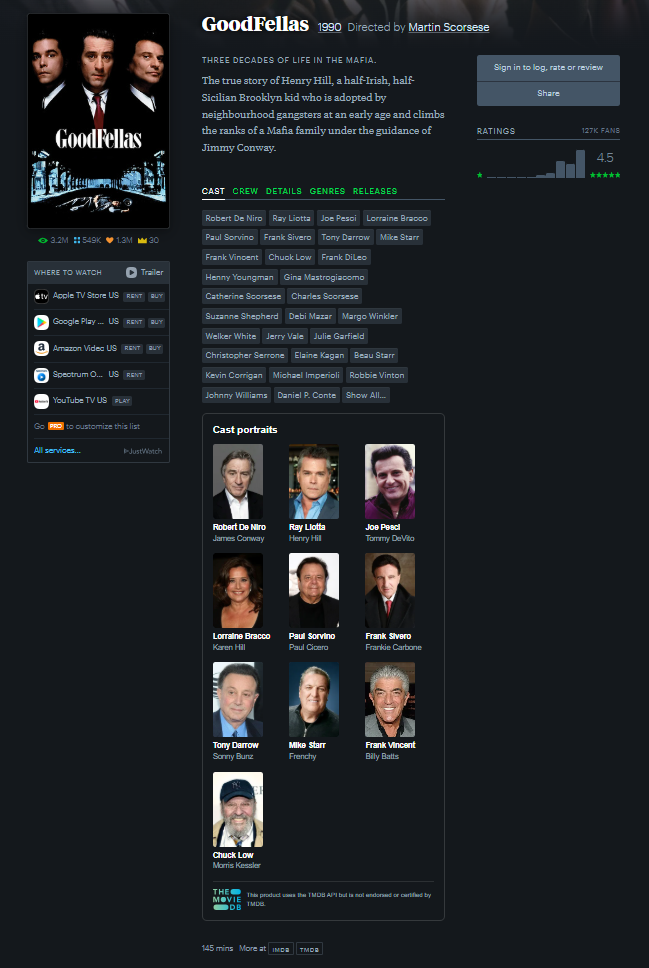
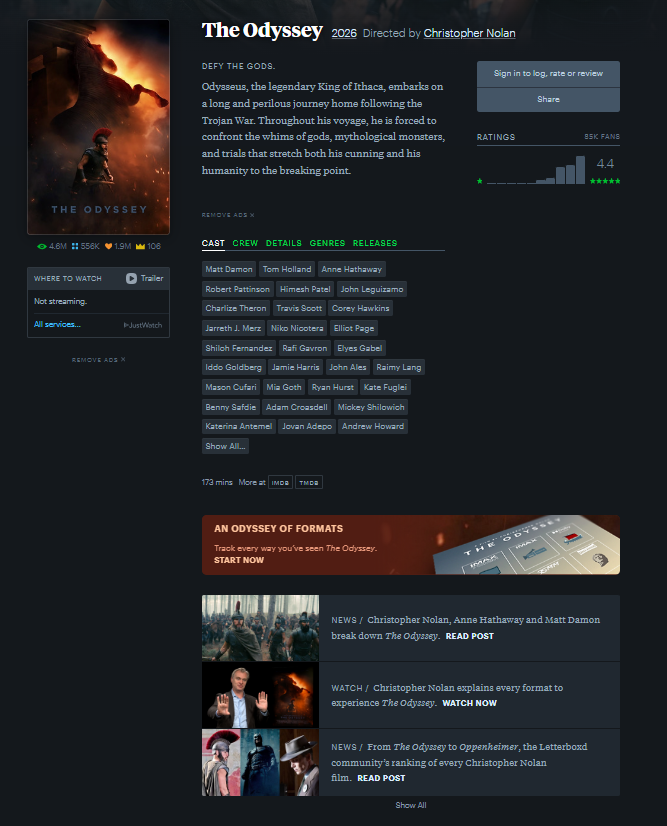
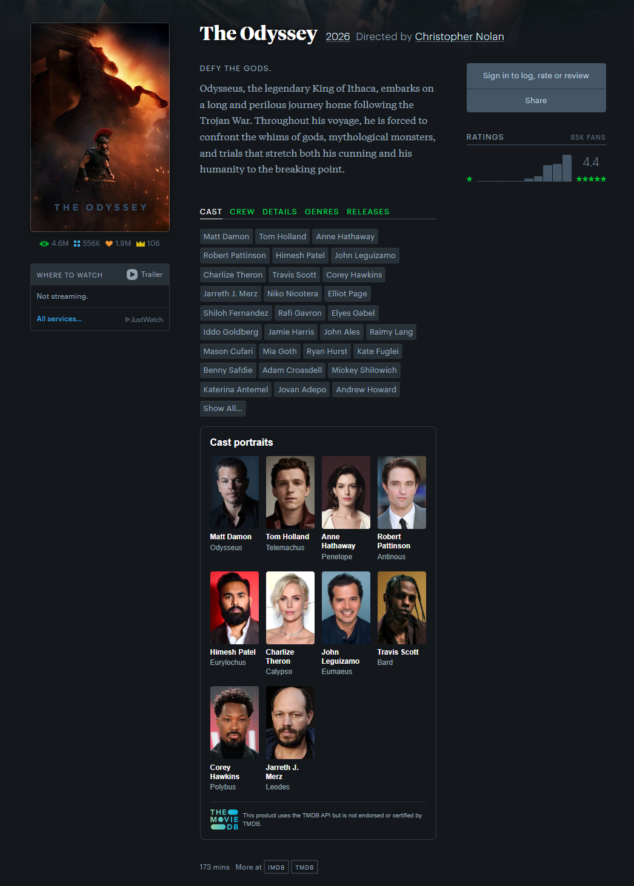
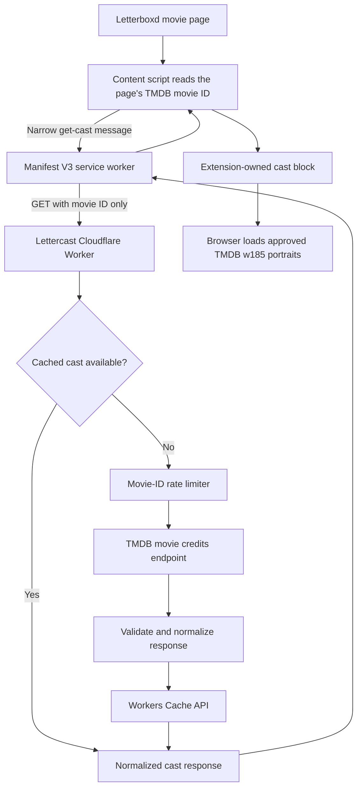

# Lettercast

Lettercast is a Chrome-first Manifest V3 extension that adds cast photos and character names to supported Letterboxd movie pages without replacing Letterboxd's native cast list.

## The problem

Letterboxd's mobile experience shows cast portraits and character names directly. On the desktop website, cast portraits are absent and a character name is normally revealed only by hovering over an actor's name. Lettercast makes that information visible at a glance by adding a separate **Cast portraits** section beneath the native cast list.

## Before and after

### GoodFellas

| Before Lettercast | After Lettercast |
| :---: | :---: |
|  |  |

### The Odyssey

| Before Lettercast | After Lettercast |
| :---: | :---: |
|  |  |

## How it works



The content script only reads and renders the Letterboxd page. Its single application request goes through the extension service worker to the Lettercast Worker. The Worker keeps the TMDB token secret, validates TMDB data, caches cast results, and applies movie-ID-based rate limiting. Lettercast does not send movie titles, page URLs, DOM content, cookies, analytics, or user identity.

## How to use Lettercast

1. Install the unpacked extension using the instructions below.
2. Leave Lettercast enabled in your browser's extension manager.
3. Open a supported movie page on [Letterboxd](https://letterboxd.com/).
4. Scroll below Letterboxd's native cast list.
5. The **Cast portraits** section appears automatically with up to ten actors, their TMDB portraits, and character names.

There is no account, settings page, or API key for users to configure. Unsupported pages are left unchanged. If the Lettercast backend or an image is unavailable, the native Letterboxd page remains usable.

## Showcase installation

Once v1 is published:

1. Download `lettercast-1.0.0-chrome.zip` from [GitHub Releases](../../releases). Do not download GitHub's automatic **Source code** archive.
2. Optionally verify that the ZIP's SHA-256 is `2ce0db5ae36b93dd57a142f85455d1ad29fd203df265ed3901315ad28380121f`. On PowerShell, run `Get-FileHash .\lettercast-1.0.0-chrome.zip -Algorithm SHA256`.
3. Extract the ZIP to a permanent folder.
4. Open `chrome://extensions` in Chrome or `edge://extensions` in Edge.
5. Enable **Developer Mode**.
6. Select **Load unpacked**.
7. Select the extracted directory containing `manifest.json`.
8. Confirm the extension ID is `oibdnmbbockloodlflplcjdfpnnlppnl`, then visit a supported Letterboxd movie page.

This portfolio/showcase distribution requires Developer Mode and manual updates. It has no Chrome Web Store review or automatic update channel. To update, replace the extracted files with a newer verified release and reload the extension. To remove Lettercast, select **Remove** in the extension manager and delete the extracted folder. Managed browsers may prohibit unpacked extensions, and cast enhancement requires the Lettercast backend to remain available.

### Why manual distribution?

Lettercast was initially planned for the Chrome Web Store. For this portfolio/showcase release, the US$5 developer registration fee and additional submission time were not proportionate to the project's goals. The v1 release therefore uses a free GitHub Release ZIP and manual unpacked installation while preserving the same reviewed extension and backend architecture. See [ADR 0011](docs/decisions/0011-distribute-v1-as-an-unpacked-github-release.md) for the decision and tradeoffs.

## Who provides the TMDB API access?

Users do not provide a TMDB key. Every installed copy calls the deployed Lettercast Cloudflare Worker, which uses the maintainer's TMDB token only on the server. The token is never included in the extension, browser request, repository, or release ZIP.

This means installed copies share the same backend and ultimately the maintainer's TMDB API access. Workers Cache reduces repeated TMDB calls, while a coarse rate limit of 60 requests per 60 seconds for each movie ID limits repeated abuse without identifying users. The maintainer remains responsible for backend availability and upstream usage. The narrow cast endpoint is intentionally public because a distributed extension cannot safely contain a client secret; see [ADR 0010](docs/decisions/0010-treat-cast-endpoint-as-unauthenticated-public-api.md).

The maintainer-hosted backend is a temporary demonstration service rather than a permanent hosted offering. A future Lettercast release is expected to provide a self-hosted workflow in which each operator supplies their own Cloudflare account and TMDB token. The transition will be documented before the shared backend is retired. After retirement, v1.0.0 will continue to leave Letterboxd pages unchanged but will no longer add cast data; users will need to migrate to the self-hosted release to retain the enhancement.

## Common questions

### What happens if I visit 50–70 films while building a Letterboxd list?

Lettercast makes one cast request for each supported movie page you open. Each movie has its own rate-limit key, so v1.0.0 does not block a user after 60 total films; the `60/60` limit applies separately to repeated requests for the same TMDB movie ID. Cached films return without another TMDB credits request, while uncached films may each require one. If the backend or TMDB cannot serve a request, Lettercast simply omits its cast block and leaves the page and your list-building workflow unchanged.

### What happens when several people open the same film?

Cast data is shared through the Worker cache rather than stored per user. A successful result is cached for 24 hours, so later requests served from that cache do not make another TMDB credits request. Cloudflare caching is distributed, so a request from another location can still produce a separate cache miss.

### Does Lettercast read or change my Letterboxd lists or account?

No. Lettercast does not request account, cookie, tab, or storage access. It reads the TMDB movie ID already present on a supported film page, renders a separate cast section, and does not add, remove, or edit films in a list.

### What happens if the Lettercast backend is unavailable or retired?

The extension fails quietly: Letterboxd's native page remains available and no Lettercast cast section is added. When a temporary outage ends, normal behavior resumes on the next page load. After the shared v1.0.0 backend is permanently retired, users will need to move to the planned self-hosted release.

### What happens on unsupported pages or when a portrait is missing?

Unsupported pages are ignored and do not trigger a Lettercast backend request. On a supported film, a missing or failed TMDB portrait becomes a neutral letter placeholder while the actor name, character name, and native Letterboxd content remain visible.

## Browser testing

Lettercast was manually tested in Chrome for failure handling, compatibility, and extension stability.

| Test | Result |
| --- | --- |
| Backend unavailable | Pass |
| Backend recovery | Pass |
| Failed portrait fallback | Pass |
| Unsupported pages ignored | Pass |
| No backend requests on unsupported pages | Pass |
| No persistent console errors | Pass |
| No duplicate cast blocks after reloads | Pass |
| Extension ID stable across locations | Pass |
| Disabling extension restores native behavior | Pass |

### Failure handling

When the Lettercast backend is unavailable, the extension leaves native Letterboxd content untouched. Normal behavior resumes after the backend becomes available. Failed TMDB portraits become neutral letter placeholders while actor names, character names, and page content remain intact.

### Page compatibility and stability

Unsupported Letterboxd pages remain unchanged and do not trigger Lettercast backend requests. Repeated reloads do not create duplicate cast blocks, and no persistent Lettercast-related console errors were observed. The stable extension ID is preserved across extraction locations; disabling Lettercast restores the native page.

## Project status

The v1 implementation, automated checks, and manual browser acceptance are complete. Production release work is tracked in the [release checklist](docs/release-checklist.md), and publication-ready copy is in the [v1.0.0 release notes](docs/release-notes-v1.0.0.md). The repository remains private until the owner approves publication.

## Repository layout

- `apps/extension` — WXT content script and MV3 service worker.
- `apps/worker` — Cloudflare Worker, TMDB integration, cache, and rate limiter.
- `packages/contracts` — shared runtime contracts and boundary validators.
- `tests/e2e` — mocked-network Chromium tests for the packaged extension.
- `docs` — architecture, ADRs, spike evidence, implementation, and release records.

## Install and validate the repository

Node 24.18.0 and pnpm 12.3.4 are pinned. Use Corepack:

```text
corepack pnpm install --frozen-lockfile
corepack pnpm exec playwright install chromium
corepack pnpm run ci
```

The aggregate check runs linting, type-checking, unit and integration tests, production builds, security assertions, and the mocked Chromium smoke suite. It requires no TMDB token or Cloudflare credentials. Individual commands are:

```text
corepack pnpm lint
corepack pnpm typecheck
corepack pnpm test
corepack pnpm build
corepack pnpm security
corepack pnpm test:e2e
```

Run `build` before `security`, because the security check inspects generated artifacts. Production outputs are `apps/extension/.output/chrome-mv3` and `apps/worker/dist`.

## Local development

For the Worker, copy `apps/worker/.dev.vars.example` to the ignored `apps/worker/.dev.vars.rate-limit-validation`, replace both placeholders, then run:

```text
corepack pnpm --filter @lettercast/worker dev
```

This local environment uses validation-only rate-limit values, not production settings. The Worker accepts requests without `Origin`; when an Origin is supplied, it must exactly match the configured `chrome-extension://<id>` value.

For the extension, provide an HTTPS Worker origin through `WXT_LETTERCAST_API_ORIGIN`, then run:

```text
corepack pnpm --filter @lettercast/extension dev
```

Without that variable, the generated manifest intentionally has no backend host permission. The deterministic Playwright suite supplies its own test-only HTTPS origin and mocks every external request. Use an HTTPS deployment or tunnel for manual extension-to-Worker integration; the default local Wrangler HTTP server is intended for Worker-focused development.

## Release configuration

The TMDB token belongs in a Wrangler secret, never Git or an extension bundle:

```text
corepack pnpm --filter @lettercast/worker exec wrangler secret put TMDB_API_TOKEN --env production
```

Run that command only through the reviewed version workflow in the [release checklist](docs/release-checklist.md).

## Documentation authority

Read [AGENTS.md](AGENTS.md) first for contributor constraints, then [docs/architecture.md](docs/architecture.md) for the v1 source of truth. ADRs under `docs/decisions` protect accepted decisions; spike notes under `docs/spikes` preserve evidence rather than permanent guarantees.
